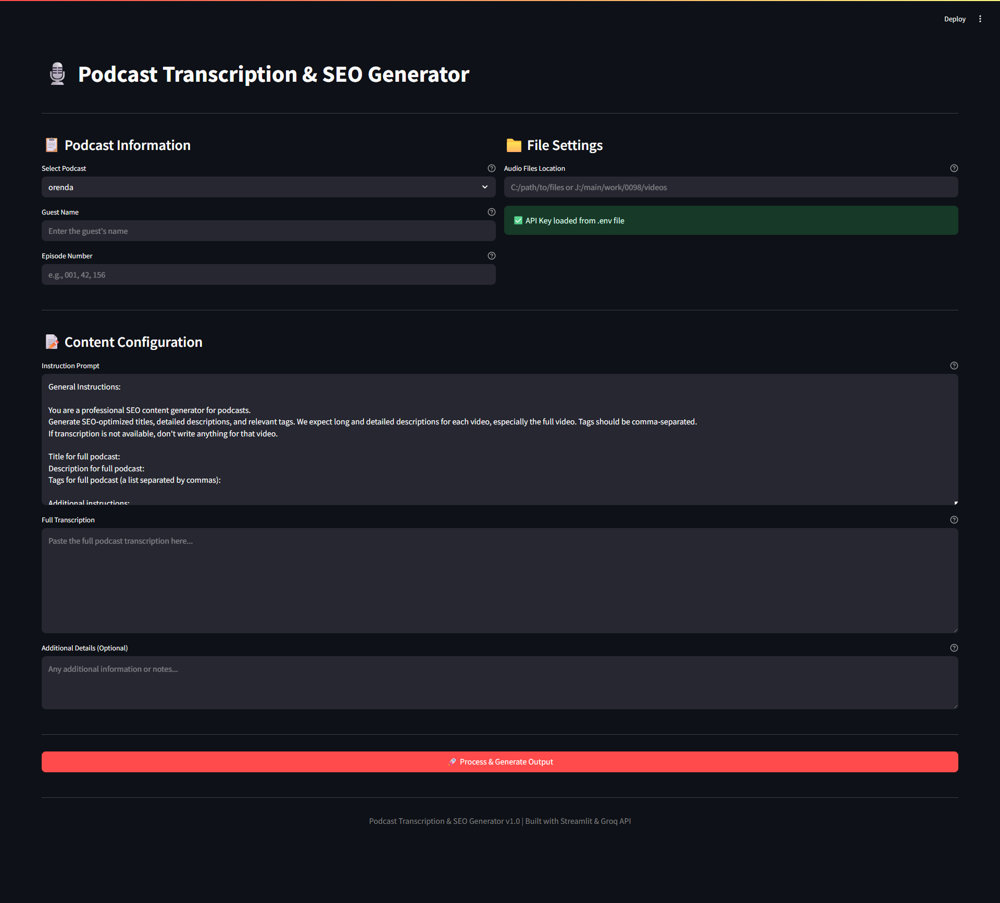

# Bulk SEO Content Generator for Podcasts

A Streamlit-based application to automate the generation of SEO-optimized titles, descriptions, and tags for podcast episodes using AI (Groq and OpenAI).

## Features
- **Bulk Processing**: Handles up to 20 MP3 files in a single run  
- **AI-Powered Transcription**: Uses Groq's Whisper model for audio transcription  
- **SEO Optimization**: Generates SEO-friendly metadata using OpenAI's GPT-4.1  
- **User-Friendly Interface**: Simple Streamlit UI with clear input fields  
- **Error Handling**: Gracefully skips missing files and handles API errors  

## Prerequisites
- Python 3.9+  
- [Groq API key](https://console.groq.com/)  
- [OpenAI API key](https://platform.openai.com/)   

## Installation

### 1. Clone Repository
```bash
git clone https://github.com/pmuwimukthi/Bulk-SEO-Content-Generator.git
cd podcast-seo-generator
```

### 2. Install Dependencies
```bash
pip install -r requirements.txt
```

###3. Configure Environment
Create .env file:
```bash
GROQ_API_KEY="your_groq_api_key"
OPENAI_API_KEY="your_openai_api_key"
```

### Configuration
MP3 Files: Place your podcast episodes in a folder named audio_files/ with naming convention:

1.mp3, 2.mp3, ..., 20.mp3 ( up to 20 files at onece )

### Usage
```bash
streamlit run app.py
```

### Workflow:

Input Fields:

Podcast details (required)
- General instructions (pre-filled template)
- Optional notes
- Path to MP3 directory

Processing:

Automatic transcription of all MP3 files
AI-generated SEO metadata creation
Error handling for missing files

Output:

Generated generated_seo_content.txt file
Preview of generated content in UI

### Troubleshooting
Common Issues:


- API Errors: Verify API keys in .env

- Missing Dependencies: Run pip install -r requirements.txt

- File Not Found: Verify MP3 path and naming convention

- Audio Processing: Ensure FFmpeg is installed

### License
MIT License - See LICENSE

### Acknowledgments

- Groq for Whisper API

- OpenAI for GPT-4.1 integration

- Streamlit for UI framework

Note: Replace placeholder paths and API keys with your actual values before use. For optimal results, ensure audio files are clear and properly formatted (MP3 format, 16kHz+ sample rate).

### UI

